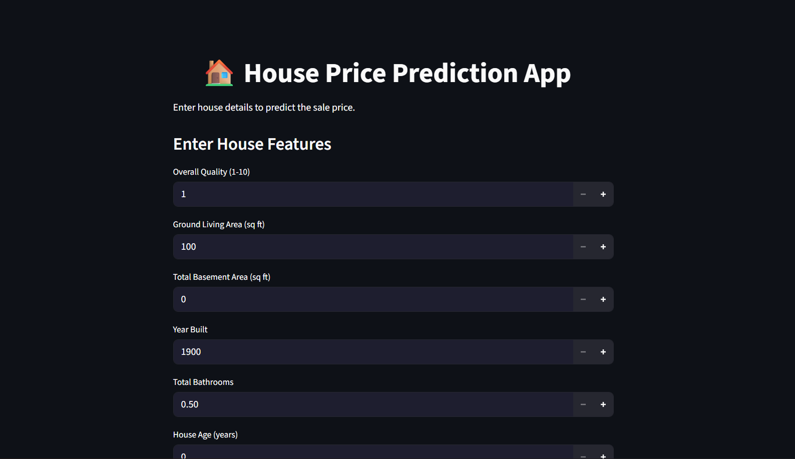

# House Price Prediction using Machine Learning
## Project Overview

This project focuses on predicting house prices using machine learning techniques based on various features of residential properties.

The goal of this project is to build a regression model that can accurately estimate the SalePrice of a house using historical housing data. The project demonstrates an end-to-end machine learning workflow starting from data exploration to model deployment.

The complete pipeline includes:

-Data Preprocessing
-Exploratory Data Analysis (EDA)
-Feature Engineering
-Model Training
-Model Evaluation
-Model Deployment using Streamlit

## Project Structure
house_price_prediction/
│
├── app/
│   ├── streamlit_app.py
│   └── ui_model_training.py
│
├── data/
│   ├── processed_data/
│   │   └── model_data.pkl
│   │
│   └── raw_data/
│       ├── train.csv
│       ├── test.csv
│       ├── sample_submission.csv
│       └── data_description.txt
│
├── images/
│   ├── eda_images/
│   │   ├── BsmtFinSF1_vs_SalePrice.png
│   │   ├── Correlation_heatmap.png
│   │   ├── GarageArea_vs_SalePrice.png
│   │   ├── GrLivArea_vs_SalePrice.png
│   │   ├── Pairplot.png
│   │   ├── SalePrice_distribution.png
│   │   └── TotalBsmtSF_vs_SalePrice.png
│   │
│   └── ui_images/
│       ├── UI.png
│       ├── Affordable_House.png
│       ├── Average_House.png
│       └── Expensive_House.png
│
├── models/
│   ├── full_data_models/
│   │   ├── LinearRegressionModel.pkl
│   │   ├── RidgeRegressionModel.pkl
│   │   └── LassoRegressionModel.pkl
│   │
│   └── ui_models/
│       ├── linear_ui_model.pkl
│       ├── ridge_ui_model.pkl
│       └── lasso_ui_model.pkl
│
├── src/
│   ├── datapreprocessing.py
│   ├── EDA.py
│   └── model_training.py
│
├── requirements.txt
├── README.md
└── .gitignore

## Dataset

Dataset: Ames Housing Dataset (Kaggle – House Prices: Advanced Regression Techniques)

This project uses the Ames Housing Dataset, which is widely used for regression problems in machine learning.

The dataset was originally used in the Kaggle competition:

House Prices: Advanced Regression Techniques

It contains detailed information about residential houses located in Ames, Iowa.

The dataset includes various housing features such as:

-Lot Area
-Overall Quality
-Year Built
-Number of Rooms
-Garage Area
-Neighborhood
-Basement Area

The target variable used for prediction is:

-SalePrice

## Exploratory Data Analysis (EDA)

Exploratory Data Analysis was performed to better understand the dataset and identify relationships between features.

Key analysis steps include:

-Checking missing values
-Studying feature distributions
-Correlation analysis
-Detecting outliers
-Analyzing relationships between important variables and SalePrice

Visualization libraries used:

-pandas
-matplotlib
-seaborn

Some of the visualizations generated include:

-Distribution of SalePrice
-Correlation heatmap of numerical variables
-Scatter plots of important features vs SalePrice
-Pairplot of selected features

These visualizations helped identify which features are strongly related to house prices.

## Data Preprocessing

-Several preprocessing techniques were applied before training the machine learning models.

-Steps include:

-Handling missing values
-Encoding categorical variables
-Scaling numerical features
-Removing unnecessary columns

Tools used in preprocessing:

-StandardScaler
-OneHotEncoder
-OrdinalEncoder
-ColumnTransformer
-Pipeline

These preprocessing steps ensure that the dataset is properly formatted for machine learning algorithms.

## Feature Engineering

New features were created to capture additional information from the dataset and improve model performance.

Examples of engineered features include:

-HouseAge
-GarageAge
-RemodAge
-TotalBath
-TotalBsmtBath
-TotalHouseSF
-TotalPorchSF

These features combine multiple attributes to represent more meaningful characteristics of the houses.

## Model Training

Multiple regression algorithms were trained to predict the SalePrice of houses.

The models learn the relationship between housing features and the target variable.

Models used in this project:

-Linear Regression
-Ridge Regression
-Lasso Regression

Training steps include:

-Train-test split
-Feature transformation using pipelines
-Model training
-Model comparison

Libraries used:

-scikit-learn
-numpy
-pandas

## Model Evaluation

Model performance was evaluated using standard regression metrics:

-Mean Absolute Error (MAE)
-Mean Squared Error (MSE)
-Root Mean Squared Error (RMSE)
-R² Score

These metrics help determine how accurately the models predict house prices.

The best performing model was selected for deployment.

## Model Deployment

The trained model was deployed using the Streamlit framework to build an interactive web application.

The application allows users to input important housing features such as:

- Overall Quality
- Ground Living Area
- Basement Area
- Year Built
- Total Bathrooms
- House Age
- Lot Area
- Kitchen Quality
- Neighborhood

Based on these inputs, the trained machine learning model predicts the estimated house price.

The application uses a trained Ridge Regression model stored as a serialized pipeline.  
The pipeline includes both preprocessing (feature scaling and encoding) and the regression model, ensuring that the same transformations used during training are applied during prediction.

This demonstrates how a machine learning model can be integrated into a user-friendly interface for real-world prediction tasks.

Possible improvements for this project include:

-Hyperparameter tuning
-Trying advanced models like Gradient Boosting and XGBoost
-Adding more feature engineering techniques
-Deploying the model using cloud platforms

## Model Comparison

Among the tested models, Ridge Regression achieved slightly better performance compared to Linear Regression and Lasso Regression.

This improved performance occurs because Ridge Regression applies L2 regularization, which reduces overfitting by shrinking the magnitude of model coefficients while retaining all features.

In contrast, Lasso Regression uses L1 regularization, which can force some coefficients to become zero and remove certain features. While this can be useful for feature selection, it may reduce predictive performance if important features are removed.

Since the Ames Housing dataset contains several correlated features, Ridge Regression was able to maintain stable predictions while controlling overfitting, leading to slightly better overall performance.

## Running the Application

To run this project locally:

1. Clone the repository
git clone https://github.com/sitharthan006/House-Price-Prediction-ML.git

2. Navigate to the project directory

3. Install dependencies
pip install -r requirements.txt

4. Run the Streamlit application
streamlit run app/streamlit_app.py

The application will open in your browser where you can input house features and get price predictions.

## Technologies Used

- Python
- pandas
- numpy
- scikit-learn
- matplotlib
- seaborn
- scipy
- streamlit
- ydata-profiling

## Application Interface

Below is the Streamlit application used for predicting house prices.

